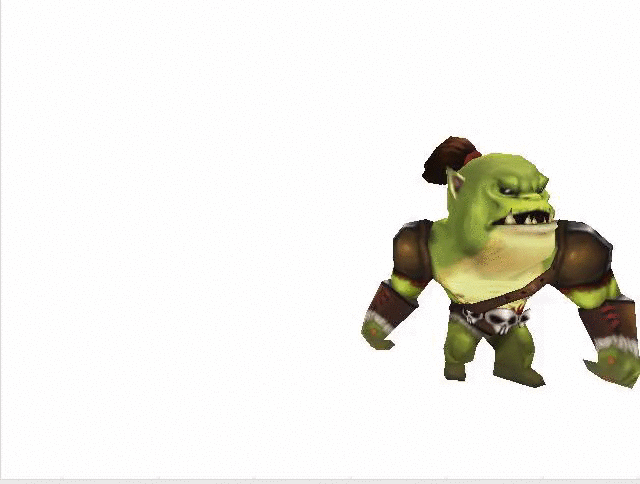
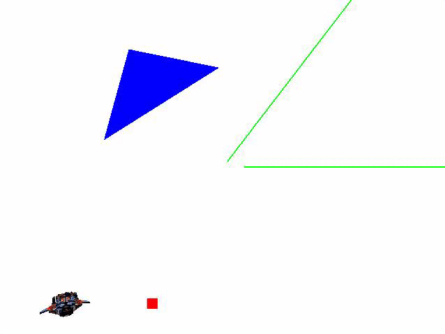

# MGRRenderer

お手製のCGレンダラー。

CGレンダラーとは、CGのモデルデータ(objファイルやfbxファイルなど)から最終的に画面に描画させる描画データを生成するものを指します。

少しずつ機能追加とリファクタリングをしていきます。
指摘やアドバイスや情報提供大歓迎です。

現状

・2Dのプリミティブ図形、スプライト、3Dのプリミティブ図形、objフォーマット、c3tフォーマット（fbxからコンバートしたcocos2d-xの独自フォーマット。JSON。）のモデル表示に対応。

これから

・c3b（fbxからコンバートしたcocos2d-xの独自フォーマット。バイナリ。）対応。ビルボード対応。最適化。

現状機能のスクリーンショット

 
 
