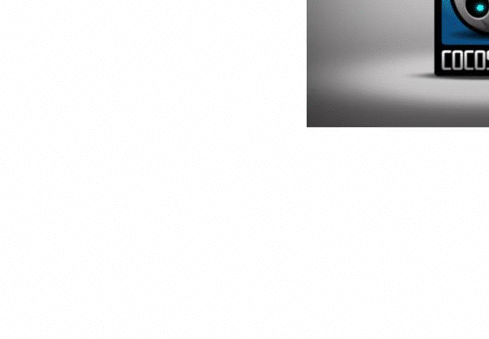

# MGRRenderer

お手製のCGレンダラー。

CGレンダラーとは、CGのモデルデータ(objファイルやfbxファイルなど)から最終的に画面に描画させる描画データを生成するものを指します。

少しずつ機能追加とリファクタリングをしていきます。
指摘やアドバイスや情報提供は大歓迎です。

ベースグラフィックスAPIをDirect3D/OpenGLのどちらにするか選択できます。
Config.hを編集して切り替えます。

現状の機能

・OpenGL
2Dのプリミティブ図形、スプライト、3Dのプリミティブ図形、ビルボード、objフォーマット、c3t/c3bフォーマット（fbxからコンバートしたcocos2d-xの独自フォーマット。）、モーション、単純なライティング、Phongシェーディング、単一平行光のシャドウマップによる影生成、パーティクル。

・Direct3D
3Dポリゴン、スプライト

これからの追加機能予定

・Direct3Dの機能追加、グラフィックAPIとレンダラの切り離し。複数カメラ、複数ライトによる影生成、シャドウボリューム、各種テクスチャベイク、環境マップ、物理ベースレンダリング、その他各種レンダリング表現。最適化とソースの整理。

現状機能のスクリーンショット

・OpenGL版
 

・Direct3D版
 
