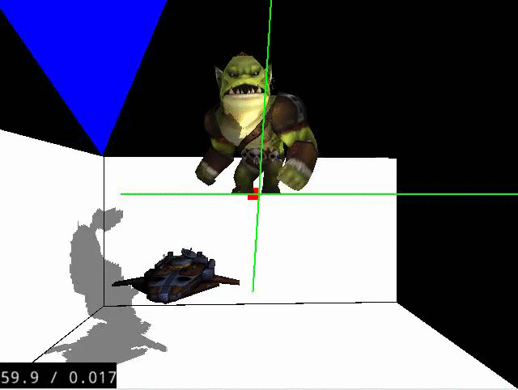

# MGRRenderer

お手製のCGレンダラー。

CGレンダラーとは、CGのモデルデータ(objファイルやfbxファイルなど)から最終的に画面に描画させる描画データを生成するものを指します。

少しずつ機能追加とリファクタリングをしていきます。
指摘やアドバイスや情報提供は大歓迎です。

現状の機能

・2Dのプリミティブ図形、スプライト、3Dのプリミティブ図形、ビルボード、objフォーマット、c3t/c3bフォーマット（fbxからコンバートしたcocos2d-xの独自フォーマット。）、モーション、単純なライティング、Phongシェーディング、単一平行光のシャドウマップによる影生成。

これからの追加機能予定

・複数カメラ、複数ライトによる影生成、シャドウボリューム、各種テクスチャベイク、環境マップ、物理ベースレンダリング、その他各種レンダリング表現。最適化とソースの整理。

現状機能のスクリーンショット

 
